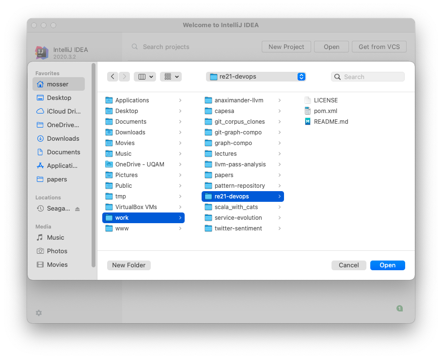

# Requirements Engineering in the DevOps Era

  - Authors: Sébastien Mosser (UQAM) & Jean-Michel Bruel (Université de Toulouse)
  - Version: 2021.09 (RE 2021)

## Objectives

  - Create a toy application in java to order drinks in a bar;
  - Express acceptance scenarios to support requirements engineering;
  - Implement a _Continous Integration/Continuous Deployment_ (CI/CD) pipeline

## Preliminaries

  - Java
  - Git
  - Maven
  - Docker
  - Read the slides

## Act I: Technical environment

### Step I.1: Creating a Maven project

Create a file named `pom.xml`, to store the _Project Object Model_. This fille will describe in a declarative way what dependencies and biuld tools we are using in this tutorial. If you prefern an imperative approach, you can use _Gradle_ instead of _Maven_.

```
<?xml version="1.0" encoding="UTF-8"?>
<project xmlns="http://maven.apache.org/POM/4.0.0"
         xmlns:xsi="http://www.w3.org/2001/XMLSchema-instance"
         xsi:schemaLocation="http://maven.apache.org/POM/4.0.0
  http://maven.apache.org/maven-v4_0_0.xsd">
    <modelVersion>4.0.0</modelVersion>
    <groupId>io.github.ace-lectures</groupId>
    <artifactId>re-21</artifactId>
    <version>1.0-SNAPSHOT</version>
    <name>RE 2021 tutorial</name>
    <packaging>jar</packaging>
    
    <properties>
        <maven.compiler.source>16</maven.compiler.source>
        <maven.compiler.target>16</maven.compiler.target>
        <project.build.sourceEncoding>UTF-8</project.build.sourceEncoding>
    </properties>
    
</project>
```

The file basically states (using `properties`) that we're developping a Java 16 project with UTF-8 files.

We can also create two directories: `src/main/java` and `src/test/java`.

### Step I.2: Loading into your favorite IDE

Our project being a Maven project, a _smart_ IDE will recognize the structure and silently import it.



### Step I.3: Create a dumb application

We are going to create an Hello World program just to check that everything is correct.

Create a file named `Main.java` in `src/main/java`, with the following contents:

```java
public class Main {
    public static void main(String[] args) {
        System.out.println("Welcome to this tutorial!");
    }
}
```

To compile the program:

```
mosser@loki re21-devops % mvn clean package
...
[INFO] ------------------------------------------------------------------------
[INFO] BUILD SUCCESS
[INFO] ------------------------------------------------------------------------
[INFO] Total time:  1.613 s
[INFO] Finished at: 2021-09-19T12:02:00-04:00
[INFO] ------------------------------------------------------------------------
```

To execute it:

```
mosser@loki re21-devops % mvn -q exec:java -Dexec.mainClass=Main
Welcome to this tutorial!
```

We are now ready to talk about requirements engineering!

## Act II: Creating Acceptance Scenarios

We focus here on the three following user stories:

  - _As_ Romeo, _I want to_ create an empty order for Juliet _so that_ I can add drinks later.
  - _As_ Romeo, _I want to_ add a drink into an order  _so that_ I can drink it.
  - _As_ Romeo, _I want to_ pay for an order _so that_ I'm not going to jail.

### Step II.1: Load _Cucumber_

Cucumber is the acceptance testing framework used in this tutorial. To load it, we will add into our _Project Object Model_ the dependencies referring to Cucumber, as well as Junit, the reference framework for unit testing in Java (as cucumber is built on top of Junit)

```xml
<dependencies>
    <dependency>
        <groupId>io.cucumber</groupId>
        <artifactId>cucumber-java</artifactId>
        <version>6.10.4</version>
        <scope>test</scope>
    </dependency>
    <dependency>
         <groupId>io.cucumber</groupId>
         <artifactId>cucumber-junit</artifactId>
         <version>6.10.4</version>
         <scope>test</scope>
    </dependency>
    <dependency>
         <groupId>junit</groupId>
         <artifactId>junit</artifactId>
         <version>4.13.2</version>
         <scope>test</scope>
    </dependency>
```
### Step II.2: Write a simple Unit test

The test checks that, when an order is created, it is sempty by default. Create a class named `OrderUnitTest` in the `src/test/java` directory:

```java
import org.junit.Test;

import java.util.List;

import static org.junit.Assert.assertEquals;

public class OrderUnitTest {

    @Test
    @Test public void empty_order_by_default(){
        Order o = new Order();
        o.setOwner("Romeo");
        o.setRecipient("Juliet");
        List<Order.Drink> drinks = o.getDrinks();
        assertEquals(0, drinks.size());
    }
}
```

We need two supporting classes to support this test: `Order` (with three methods: `setOwner`, `setRecipient` and `getDrinks`), and `Drink`. This should not be a surprise, as our objective is to define a piece of software to order drinks.

We are not interested (for now) by the implementation of the system, as we eant the architecture to emerge from the tests. **We made the choice here to declare `Drink` as an internal class, to minimize the number of files we're interacting with**.

Create a class named `Order` in `src/main/java`:

```java
public class Order {

    public void setOwner(String who) { /* ...*/ }
    public void setRecipient(String who) { /* ...*/ }
    public List<Order.Drink> getDrinks() { return new LinkedList<>(); }

    static class Drink { 
        public Drink(String name){ }  
    }
}
```

To run this  test:

```
mosser@loki re21-devops % mvn -q test
-------------------------------------------------------
 T E S T S
-------------------------------------------------------
Running OrderUnitTest
Tests run: 1, Failures: 0, Errors: 0, Skipped: 0, Time elapsed: 0.063 sec
Results :
Tests run: 1, Failures: 0, Errors: 0, Skipped: 0
```

### Step II.3: Activate cucumber for the project

To date, only JUnit tests are executed. To integrate acceptance scenarios insode the system, we need to activate the _cucumber_ framework in the project. We'll catch the Junit train and create a bridge (named `RunCucumberTest`) to lure JUnit into executing our acceptance scenarios in addtion to classical unit testing.

To create the bridge, create a class named `RunCucumberTest` in the `src/test/java` directory:

```java
import io.cucumber.junit.Cucumber;
import io.cucumber.junit.CucumberOptions;
import org.junit.runner.RunWith;

@RunWith(Cucumber.class)
@CucumberOptions(plugin = {"pretty"})
public class RunCucumberTest {}
```

**This class will stay as is. This is just a way to catch Junit, and asks the framework to start the cucumber process (with the `@RunWith(Cucumber.class)` annotation).**

### Step II.4: Migrate from a Unit Test to an Acceptance Scenario (Story #1)


Create a `src/test/resources` directory, and a file named `ordering.feature`. This file describe our acceptance scenario for the story under consideration here, containing three steps:

```gherkin
Feature: Ordering drinks
  Scenario: Creating an empty order
    Given Romeo who wants to create an Order
    When Juliette is declared as recipient
    Then the order does not contain any drinks
```

We now need to create the code that support each steps. Create a class named `StepDefinitions` in `src/test/Java`, with the following contents:

```java
import io.cucumber.java.en.*;
import java.util.List;
import static org.junit.Assert.*;

public class StepDefinitions {

    private Order o;

    @Given("Romeo who wants to create an Order")
    public void creating_an_order(){ throw new PendingException(); }

    @When("Juliette is declared as recipient")
    public void declaring_recipient(){ throw new PendingException(); }

    @Then("the order does not contain any drinks")
    public void check_emptyness() { throw new PendingException(); }
    }
}
```

We can now try to execute the acceptance scenario:

```
mosser@loki re21-devops % mvn -q test
-------------------------------------------------------
 T E S T S
-------------------------------------------------------
Running OrderUnitTest
Tests run: 1, Failures: 0, Errors: 0, Skipped: 0, Time elapsed: 0.097 sec
Running RunCucumberTest

Scenario: Creating an empty order            # odering.feature:3
  Given Romeo who wants to create an Order   # StepDefinitions.creating_an_order()
      io.cucumber.java.PendingException: TODO: implement me
	at StepDefinitions.creating_an_order(StepDefinitions.java:12)
	at ✽.Romeo who wants to create an Order(classpath:odering.feature:4)

  When Juliette is declared as recipient     # StepDefinitions.declaring_recipient()
  Then the order does not contain any drinks # StepDefinitions.check_emptyness()
Tests run: 1, Failures: 0, Errors: 1, Skipped: 0, Time elapsed: 0.432 sec <<< FAILURE!
Creating an empty order(Ordering drinks)  Time elapsed: 0.117 sec  <<< ERROR!
io.cucumber.java.PendingException: TODO: implement me
	at StepDefinitions.creating_an_order(StepDefinitions.java:12)
	at ✽.Romeo who wants to create an Order(classpath:odering.feature:4)

Results :
Tests in error: 
  Creating an empty order(Ordering drinks): TODO: implement me
Tests run: 2, Failures: 0, Errors: 1, Skipped: 0
```

Withour surprise, as there is no code to make a link between our high-level acceptance scenario and the real code, we do not have any meaningful results. Let us map the formerly defined unit test into the different steps:

```java
@Given("Romeo who wants to create an Order")
public void creating_an_order() {
    o = new Order(); o.setOwner("Romeo");
}

@When("Juliette is declared as recipient")
public void declaring_recipient(){ o.setRecipient("Juliet");  }

@Then("the order does not contain any drinks")
public void check_emptiness() {
    List<Order.Drink> drinks = o.getDrinks();
    assertEquals(0, drinks.size());
}
```

And execute it:

```
mosser@loki re21-devops % mvn -q test
-------------------------------------------------------
 T E S T S
-------------------------------------------------------
Running OrderUnitTest
Tests run: 1, Failures: 0, Errors: 0, Skipped: 0, Time elapsed: 0.056 sec
Running RunCucumberTest

Scenario: Creating an empty order            # odering.feature:3
  Given Romeo who wants to create an Order   # StepDefinitions.creating_an_order()
  When Juliette is declared as recipient     # StepDefinitions.declaring_recipient()
  Then the order does not contain any drinks # StepDefinitions.check_emptyness()
Tests run: 1, Failures: 0, Errors: 0, Skipped: 0, Time elapsed: 0.322 sec

Results :
Tests run: 2, Failures: 0, Errors: 0, Skipped: 0
```

### Step II.5: Use parameters to make scenarios more expressive (Story #2)

Add the following scenario to the `ordering.feature` file:

```gherkin
Scenario: Adding a drink to an order
  Given Tom who wants to create an Order
  When Jerry is declared as recipient
  And a "PepsaCola Zero" is added to the order
  Then the order contains 1 drink
```

First, we refactor the two initial definitions so they can accept variables names. We use the `{word}` placeholder, and cucumber will match wahtever we wrote here and transfer it to the function parameter, as a String:

```java
@Given("{word} who wants to create an Order")
public void creating_an_order(String who) {
    o = new Order();
    o.setOwner(who);
}

@When("{word} is declared as recipient")
public void declaring_recipient(String who){
    o.setRecipient(who);
}
```

Now we can enrich our steps by adding the two missing ones:

```java
@When("a {string} is added to the order")
public void add_drink_to_the_order(String drinkName){
    o.getDrinks().add(new Drink(drinkName));
}

@Then("the order contains {int} drink(s?)")
public void check_order_size(int size) {
    assertEquals(size, o.getDrinks().size());
}
```

If we try to execute the test suite now, it ends up with an error: the list is still empty!

```
mosser@loki re21-devops % mvn -q test
...
Tests run: 2, Failures: 1, Errors: 0, Skipped: 0, Time elapsed: 0.367 sec <<< FAILURE!
Creating an empty order #2(Ordering drinks)  Time elapsed: 0.01 sec  <<< FAILURE!
java.lang.AssertionError: expected:<1> but was:<0>
	at org.junit.Assert.fail(Assert.java:89)
	at org.junit.Assert.failNotEquals(Assert.java:835)
	at org.junit.Assert.assertEquals(Assert.java:647)
	at org.junit.Assert.assertEquals(Assert.java:633)
	at StepDefinitions.check_order_size(StepDefinitions.java:28)
	at ✽.the order contains 1 drink(classpath:odering.feature:12)
```

We can fix this by moving the list initialization in the `Order` class:

```java
public class Order {

    /* ... */ 
    private List<Drink> contents = new LinkedList<>();
    public List<Order.Drink> getDrinks() { return contents; }
    
}
```

**Warning: this design is terrible in terms of object-orientation (public accessors, information leak, external modification of private contents, ...). We're only focusing here on how to express acceptance scenarios!**

### Step III.7: Make the scenario more precise (Story #2 updated)

We now want to support the following acceptance scenario:

```gherkin
Scenario: Checking the contents of an order
  Given Seb who wants to create an Order
  When Jean-Michel is declared as recipient
    And a "PepsaCoke Zero" is added to the order
    And a "DietCola Max" is added to the order
    And another "PepsaCoke Zero" is added to the order
  Then the order contains 3 drinks
    And the order contains 2 "PepsaCoke Zero"
    And the order contains 1 "DietCola Max"
```

First, we need to improve the `Drink` class to make the drink's name more usefull:

```java
static class Drink {
    public Drink(String name){ this.name = name; }
    private String name;
    public String getName() { return name; }
}
```

Then we need to adapt the regular expressions of the existing steps to support plurals (e.g., _drink**s**_, _a**nother**_ drink)

```java
@When("a(nother?) {string} is added to the order")
public void add_drink_to_the_order(String drinkName){ /* ... */ }

@Then("the order contains {int} drink(s?)")
public void check_order_size(int size) { /* ... */ }
```

Finally we can create the last assertion checking, counting how many drinks of a given kind are available:

```java
@Then("the order contains {int} {string}")
public void check_order_contents(int size, String drink) {
    long count = o.getDrinks().stream()
                  .filter(d -> d.getName().equals(drink))
                  .count();
    assertEquals(size,count);
}
```

And run the test scenario

```
mosser@loki re21-devops % mvn -q test
-------------------------------------------------------
 T E S T S
-------------------------------------------------------

...

Scenario: Checking the contents of an order          # odering.feature:14
  Given Seb who wants to create an Order             # StepDefinitions.creating_an_order(java.lang.String)
  When Jean-Michel is declared as recipient          # StepDefinitions.declaring_recipient(java.lang.String)
  And a "PepsaCoke Zero" is added to the order       # StepDefinitions.add_drink_to_the_order(java.lang.String)
  And a "DietCola Max" is added to the order         # StepDefinitions.add_drink_to_the_order(java.lang.String)
  And another "PepsaCoke Zero" is added to the order # StepDefinitions.add_drink_to_the_order(java.lang.String)
  Then the order contains 3 drinks                   # StepDefinitions.check_order_size(int)
  And the order contains 2 "PepsaCoke Zero"          # StepDefinitions.check_order_contents(int,java.lang.String)
  And the order contains 1 "DietCola Max"            # StepDefinitions.check_order_contents(int,java.lang.String)
Tests run: 3, Failures: 0, Errors: 0, Skipped: 0, Time elapsed: 0.345 sec

Results :
Tests run: 4, Failures: 0, Errors: 0, Skipped: 0
```
### Step III.6: Use mocks to support missing parts (Story #3)

We now consider a database used to store the price of each drinks. For testing purpose, we do not need to use a _real_ database, we only need a _dummy_ onnnnne answering what we told it it to answer. This is the precise rationale of _mock_ objects.

First, we create the interface of this price database, as a `Catalogue` interface in `src/main/java`:

```java
public interface Catalogue {
    Double getPrice(String drinkName);
}
```

then, we create the following scenario to check the price of a given order:

```gherkin
Scenario: Paying the price
  Given the price of a "PepsaCoke Zero" being 2.75 dollars
    And the price of a "DietCola Max" being 2.55 dollars
    And taxes in Quebec being 15%
  When a "PepsaCoke Zero" is added to the order
    And a "DietCola Max" is added to the order
  Then the price with taxes is 5.30 dollars
    And the price including taxes is 6.10 dollars
```

We add three missing methods in the `Order` class: remembering the tax rate, and computinng prices.

```java
public void setTaxes(double rate) { this.taxes = rate; }

public double computePrice(Catalogue catalogue){
    return this.getDrinks().stream()
               .map(d -> catalogue.getPrice(d.getName()))
               .reduce(0.0, Double::sum);
}

public double computePriceWithTaxes(Catalogue catalogue){
    return new BigDecimal(this.computePrice(catalogue) * taxes)
            .setScale(2, RoundingMode.HALF_EVEN)
            .doubleValue();
}
```

Now we load _Mockito_, a reference mock framework for Java, by declaring a new dependency in the `pom.xml` file

```xml
<dependency>
    <groupId>org.mockito</groupId>
    <artifactId>mockito-core</artifactId>
    <version>3.12.4</version>
    <scope>test</scope>
</dependency>
```
And we improve the step definitions to support our new steps related to price and taxes:

```java
private Catalogue catalogue = mock(Catalogue.class);

@Given("the price of a {string} being {double} dollars")
public void the_price_of_a_being_$(String drink, Double price) {
    when(catalogue.getPrice(drink)).thenReturn(price);
}

@Given("taxes in {word} being {double}%")
public void taxes_being(String place, double rate) {
   o.setTaxes(1 + rate/100);
}

@Then("the price with taxes is {double} dollars")
public void the_price_with_taxes_is_$(Double expected) {
    assertEquals(expected, o.computePrice(catalogue), 0.01);
}

@Then("the price including taxes is {double} dollars")
public void the_price_including_taxes_is_$(Double expected) {
    assertEquals(expected, o.computePriceWithTaxes(catalogue), 0.01);
}
```

### Step III.7: Refactoring the scenarios

The scenarios are considering couples like Céline and René, Tom and Jerry, ... But actually who is ordering for who does not matter for these scenarios. Thus, we cann _factorize_ these steps into a common _Background_:

```gherkin
Background:
    Given Seb who wants to create an Order
    When Jean-Michel is declared as recipient
```

And then remove the unnecessary context initalization in all the other steps. 

## Act III: Containerization

### Step III.1: Load Jooby

Jooby is a super-light REST environment for Java. To load it into our project, we add the following dependencies into the `pom.xml` file:

```xml
<dependency>
  <groupId>io.jooby</groupId>
  <artifactId>jooby-netty</artifactId>
  <version>2.10.0</version>
</dependency>
<dependency>
  <groupId>ch.qos.logback</groupId>
  <artifactId>logback-classic</artifactId>
  <version>1.2.6</version>
</dependency>
```

If you want to have less verbose logs, connsider copy-pasting the [`logback.xml`](src/main/java/resources/logback.xml) file into the `src/main/java/resources` directory.

### Step III.2: Make the system "showable"

We need to improve a little bit our `Order` class to make it more presentable. We basically add two instance variable for `owner` and `recipient`, as well as `toString` methodes for drinks and orders.

```java
private String owner;
public void setOwner(String who) { this.owner = who; }

private String recipient;
public void setRecipient(String who) { this.recipient = who; }

@Override
public String toString() {
    return "Order: " + owner + " / " + recipient + " / { " + contents + "}";
}

static class Drink {
    // ...
    @Override public String toString() { return name; }
}
```

### III.3: Wrap the system into a  service

We create a pretty simple and naive REST service, that will declare three routes:

  - `GET /`: say hello (e.g., homepage of the tool)
  - `GET /orders`: list onngoing orders
  - `GET /orders/{owner}/{recipient}/{drink}`: add an order to the list

**Warning: the last route must not be a `GET` in an ideal world, but a `POST`. However, for the sake of demonstration simplicity, we decided to use a `GET` and only rely on plain browser features.**

We create a class named `Service`, with the following contents to declare the three routes and map the routes to method executions.

```
import io.jooby.Jooby;
import java.util.LinkedList;
import java.util.List;

public class Service extends Jooby {

    public static void main(String[] args) {
        runApp(args, Service::new);
    }

    private final List<Order> orders = new LinkedList<>();

    {
        get("/", ctx -> "Welcome to our drink ordering system");
        get("/orders", ctx -> { return getAllOrders();});
        get("/orders/{owner}/{recipient}/{drink}", (ctx) -> {
            Order o = addOrder(ctx.path("owner").value(),
                               ctx.path("recipient").value(),
                               ctx.path("drink").value());
            return "added " + o;
        });
    }

    public String getAllOrders() { return ""; }

    public Order addOrder(String owner, String recipient, String drinkName) {
        return null;
    }    
}
```

We can now focus onn _wrapping_ our business logic into the service methods:

```java
public String getAllOrders() {
    if(orders.isEmpty())
        return "Nothing to show";
    return orders.stream()
                 .map(o -> o.toString())
                 .reduce("",(s1,s2) -> s1 +"\n" + s2);
}

public Order addOrder(String owner, String recipient, String drinkName) {
    Order o = new Order();
    o.setOwner(owner);
    o.setRecipient(recipient);
    o.getDrinks().add(new Order.Drink(drinkName));
    orders.add(o);
    return o;
}
```

### Step III.4: Run the service locally

To run the service, we have to first compile it. We already know that our tests are OK, there is nno need to spend time on these tests, so to reduce the compilation time we use the `-DskipTests` flag.

```
mosser@loki re21-devops % mvn clean package -DskipTests
```

To execute the system as a service, we simply ask maven to execute the `Service` class

```
mosser@loki re21-devops % mvn -q exec:java -Dexec.mainClass=Service
[2021-09-19 17:58:24,767]-[Service.main()] INFO  Service - Service started with:
[2021-09-19 17:58:24,769]-[Service.main()] INFO  Service -     PID: 33383
[2021-09-19 17:58:24,769]-[Service.main()] INFO  Service -     netty {port: 8080, ioThreads: 16, workerThreads: 64, bufferSize: 16384, maxRequestSize: 10485760}
[2021-09-19 17:58:24,770]-[Service.main()] INFO  Service -     env: [dev]
[2021-09-19 17:58:24,770]-[Service.main()] INFO  Service -     execution mode: default
[2021-09-19 17:58:24,770]-[Service.main()] INFO  Service -     user: mosser
[2021-09-19 17:58:24,770]-[Service.main()] INFO  Service -     app dir: /Users/mosser/work/re21-devops
[2021-09-19 17:58:24,770]-[Service.main()] INFO  Service -     tmp dir: /Users/mosser/work/re21-devops/tmp
[2021-09-19 17:58:24,770]-[Service.main()] INFO  Service - routes: 

  GET /
  GET /orders
  GET /orders/{owner}/{recipient}/{drink}

listening on:
  http://localhost:8080/
```

We can now visit the different routes using our favorite browser to add orders and then list them


### Step III.5: Create an executable service

We simply ask Maven to squash all the dependencies into a single jar, and consider the `Service` class as the main one. To do this, we add the following declaration in the `pom.xml`

```xml
<build>
  <plugins>
    <plugin>
      <groupId>org.apache.maven.plugins</groupId>
      <artifactId>maven-shade-plugin</artifactId>
      <version>3.2.4</version>
      <executions>
        <execution>
          <phase>package</phase>
          <goals>
            <goal>shade</goal>
          </goals>
          <configuration>
            <finalName>${artifactId}-SHADED</finalName>
            <transformers>
              <transformer implementation="org.apache.maven.plugins.shade.resource.ManifestResourceTransformer">
                <mainClass>Service</mainClass>
              </transformer>
            </transformers>
          </configuration>
        </execution>
      </executions>
    </plugin> 
  </plugins>
</build>
```
To create the `jar` containing all the depdencies into a standalone application, we simply `package` our code:

```
mosser@loki re21-devops % mvn clean package
```

It creates a file named `re-21-SHADED.jar` in the `target` directory


### Step III.6: Wrap the webservice into a container

We need to create a image that will contains the right JRE version, as well as our application. The image also needs to start our application when instantiated into a container.

We define this image by creating a file named `Dockerfile`:

```dockerfile
# syntax=docker/dockerfile:1
FROM openjdk:16-alpine
WORKDIR /app
COPY target/re-21-SHADED.jar .
CMD ["java", "-jar", "re-21-SHADED.jar"]
```

To start a container that will deploy locally our app, we simply have to bind the ports used by our app to ports available on the host. The app use `8080` inside docker, and for the sake of demonstration we will deeploy the app locally using `9090`:

```
mosser@loki re21-devops % docker build -t acedesign/re21 .
```

To start a container running the image:

```
mosser@loki re21-devops % docker run --rm -d -p 9090:8080 --name re21-app acedesign/re21
```

You can now access the app going to [http://localhost:9090](http://localhost:9090). To stop the container:

```
mosser@loki re21-devops % docker stop re21-app
```

## Act IV: Continuous Integration & Deployment

### Steep IV.1: Prelimiaries

You'll need three accounts to support this act:

  - Githhub: to host the development of the app using Git
  - Docker Hub: to store and publish the docker image containing our app
  - Heroku: to deploy the image on a running server

you should also consider copying the [.gitignore](.gitgnore) file in your directory to avoid versionning irrelevant files.

### Step IV.2: Create a git repository

Visit the github home page and create an empty public repository.  to transform your local directory intyo a git repository, use the following instructions. 

```bash
git init
git add -A
git commit -m "first commit"
git branch -M main
git remote add origin git@github.com:XXX/YYY.git
git push -u origin main
```

The `XXX` is your github login, and `YYY` your repository name. For example, if using the `mosser` user to create a `tmp` repository, the instructionn should be: `git remote add origin git@github.com:mosser/tmp.git`

### Step IV.2: Configure an initial build pipeline

We are going to create a basic pipeline. First it lists the source code in the repositrory, and then it runs the acceptance scenarios. 

To demonstrate how parallel jobs can be run, we will categorize our scenarios into two features: `ordering` and `payment`. to do sao, we simply annotate each scenario with the relevant tag.

```gherkin
@ordering
  Scenario: Creating an empty order
    Then the order does not contain any drinks
```

Our initial pipeline contains three steps:

  1. We start by compiling the code
  2. If the code compile, we then run in parallel
    - the scenarios associated to the `ordering` feature
    - the scenario associated to the `ordering` feature

To describe the first step (compiling the code), we create a file name `pipeline.yml` in a `.github/workflows` directory. The file describe a job that checkout the code, setup java 16, build the system using maven, and finally store the JAR file in a local storage for the deployments steps.

```yml
name: CI/CD Pipeline
on: [push]

jobs:
  compile-jar:
    runs-on: ubuntu-latest
    steps:
      - run: echo "Received ${{ github.event_name }} event."
      - name: Check out repository code
        uses: actions/checkout@v2
      - name: Set up JDK 16
        uses: actions/setup-java@v2
        with:
          java-version: '16'
          distribution: 'adopt'
      - name: Build with Maven
        run: mvn --batch-mode package
      - name: Store JAR file
        uses: actions/upload-artifact@v2
        with:
          name: app
          path: target/re-21-SHADED.jar
```
To trigger this pipeline, we just have to push it to github:

```
mosser@loki tmp % git add -A; git commit -m "compilation wkflow"; git push 
```

No, we can define the two jobs to evaluate scenarios in parallel

```yaml
  test-ordering:
    needs: compile-jar
    runs-on: ubuntu-latest
    steps:
      - name: Check out repository code
        uses: actions/checkout@v2
      - name: Set up JDK 16
        uses: actions/setup-java@v2
        with:
          java-version: '16'
          distribution: 'adopt'
      - name: Build with Maven
        run: mvn --batch-mode test -D cucumber.filter.tags="@ordering"
  test-payment:
    needs: compile-jar
    runs-on: ubuntu-latest
    steps:
      - name: Check out repository code
        uses: actions/checkout@v2
      - name: Set up JDK 16
        uses: actions/setup-java@v2
        with:
          java-version: '16'
          distribution: 'adopt'
      - name: Build with Maven
        run: mvn --batch-mode test -D cucumber.filter.tags="@payment"
```

```
mosser@loki tmp % git add -A; git commit -m "acceptance steps"; git push 
```

### Step IV.3: Publish the image on the docker hub

To publish your image on the DockerHub, you need a `username` and a `password`. To deploy your image from your local computer, you need to first login into the docker hub, and then push the image

```
mosser@loki tmp % docker login  
Username: YOUR_USERNAME
Password: YOUR_PASSWORD
Login Succeeded
mosser@loki tmp % docker push YOUR_USERNAME/re21
Using default tag: latest
...
```

Now, anyone can download the image on their computer by using the following command:

```
mosser@loki tmp % docker pull acedesign/re21  
```

To automate the publication of the image, we simply add a step after the pwo defined previously

```yml
  publish-image:
    needs: [test-payment, test-ordering]
    runs-on: ubuntu-latest
    steps:
      - name: Check out repository code
        uses: actions/checkout@v2
      - name: Restore the jar with dependecies
        uses: actions/download-artifact@v2
        with:
          name: app
          path: target/re-21-SHADED.jar
      - name: Set up QEMU
        uses: docker/setup-qemu-action@v1
      - name: Set up Docker Buildx
        uses: docker/setup-buildx-action@v1
      - name: Log in to Docker Hub
        uses: docker/login-action@v1
        with:
          username: ${{ secrets.DOCKER_USERNAME }}
          password: ${{ secrets.DOCKER_PASSWORD }}
      - name: Build and push Docker image
        uses: docker/build-push-action@v2
        with:
          context: .
          push: true
          tags: ${{ secrets.DOCKER_USERNAME }}/re21
```

As you do not want your username and password written in plain text in a publicly versionned file, we are using  _secrets_. We store these information as repository secrets (encrypted), and github action will uncrypt the information at runtime in a secure way.

Go to the Github interface, and click on `Settings` for your repository. Then `Secrets`, and then `Add a new repository secret`.


## Conclusions

DevOps is way much more than _acceptance testing_ and _CI/CD_. We only had today a quick overview focusued on what is possible at the technical level. The other side of DevOps, more human-centered, cannot fit in a half-day workshop.