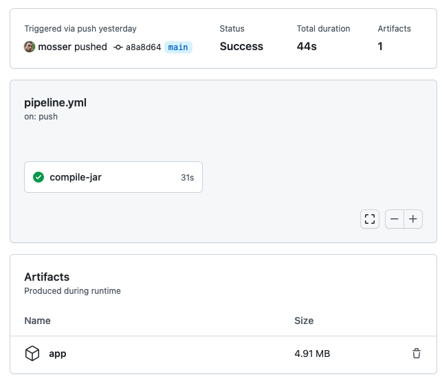
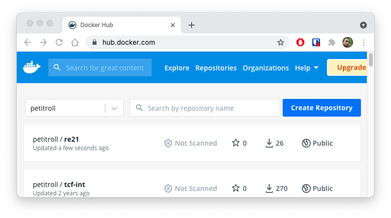
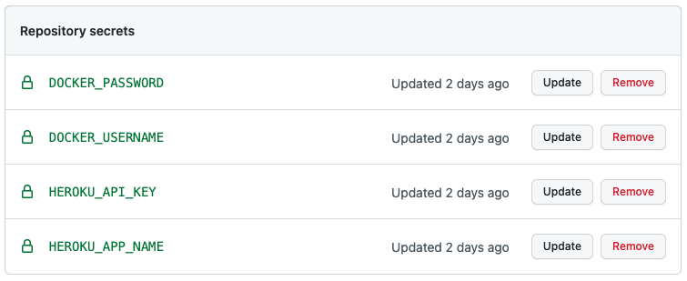
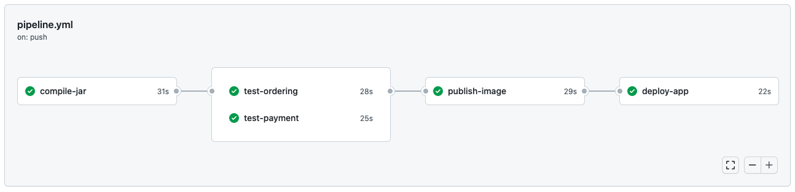

## Act IV: Continuous Integration & Deployment

## Navigation

  - [Go to summary](../README.md)
  - [Go to previous act](./Act_3.md)


### Step IV.1: Create a git repository

Visit the GitHub home page and create an empty public repository.  

To transform your local directory into a git repository, and link it to the freshly created remote repository use the following instructions. The `XXX` is your GitHub login, and `YYY` your repository name. For example, if using the `mosser` user to create a `tmp` repository, the instruction should be: `git remote add origin git@github.com:mosser/tmp.git`

```bash
git init
git remote add origin git@github.com:XXX/YYY.git
```

Copy-paste the content of the [`.gitignore`](../.gitignore) file to instruct git not to version compiled/irrelevant files.

We can now `add` all (`-A`) the other files that needs to be versioned, `commit` them to the version control system using a branch named `main`, and finally `push` the code to the remote origin (our GitHub repository).

```
git add -A
git commit -m "first commit"
git branch -M main
git push -u origin main
```

### Step IV.2: Configure a minimal pipeline

We are going to create a basic pipeline, with only one job: compiling the code and saving the _shaded_ artefact for further usage. To describe this first step, we create a file name `pipeline.yml` in a `.github/workflows` directory. 

The file describe a job named `compile-jar`, that contains several steps:

  1. checkout the code (action: `actions/checkout@v2`);
  2. setup java 16 (action: `actions/setup-java@v2`) with the _AdoptOpenJDK_ environment;
  3. build the system using maven (by `run`ning the `mvn` command), without executing the tests (`-DskipTests`);
  4. and finally store the shaded file in a local storage (action: `actions/upload-artifact@v2`).

```yml
name: CI/CD Pipeline
on: [push]

jobs:
  compile-jar:
    runs-on: ubuntu-latest
    steps:
      - name: Check out repository code
        uses: actions/checkout@v2
      - name: Set up JDK 16
        uses: actions/setup-java@v2
        with:
          java-version: '16'
          distribution: 'adopt'
      - name: Build with Maven
        run: mvn --batch-mode clean package -DskipTests
      - name: Store JAR file
        uses: actions/upload-artifact@v2
        with:
          name: app
          path: target/re-21-SHADED.jar
```
**Warning**: GitHub Actions relies on the _YAML_ syntax, which is sensitive to indentation.

To trigger this pipeline, we just have to push it to GitHub:

```
mosser@loki tmp % git add -A; git commit -m "compilation workflow"; git push 
```

We can visit the GitHub Actions webpage to watch the workflow execution, and its eventual success. The compilation is a success, and the _shaded_ jar is saved as a pipeline artifact named `app`.




## Step IV.3: Evaluating acceptance scenarios in parallel

We are going to improve the workflow, by automating the validation of our acceptance scenarios, in parallel (one job for the `payment` one, and another job for the `ordering` one). The scheduling of jobs is modelled as a dependency graph, so we need to state that each `test-*` job `needs` the `compile-jar` one.

No, we can define the job related to the `ordering` scenarios. We basically checkout the code, set up Java 16, and then ask Maven to evaluate our scenarios.

```yaml
  test-ordering:
    needs: compile-jar
    runs-on: ubuntu-latest
    steps:
      - name: Check out repository code
        uses: actions/checkout@v2
      - name: Set up JDK 16
        uses: actions/setup-java@v2
        with:
          java-version: '16'
          distribution: 'adopt'
      - name: Build with Maven
        run: mvn --batch-mode test -D cucumber.filter.tags="@ordering"
```

By copy-pasting, we cann cover the `payment` scenario:

```yaml
  test-payment:
    needs: compile-jar
    runs-on: ubuntu-latest
    steps:
      - name: Check out repository code
        uses: actions/checkout@v2
      - name: Set up JDK 16
        uses: actions/setup-java@v2
        with:
          java-version: '16'
          distribution: 'adopt'
      - name: Build with Maven
        run: mvn --batch-mode test -D cucumber.filter.tags="@payment"
```

And we can witness the execution of the improved pipeline 

```
mosser@loki tmp % git add -A; git commit -m "acceptance steps"; git push 
```

We can go to the github actions page to see the workflow in action


## Step IV.4: Release to the Docker Hub

To automate this, like we did from the command line, we need to build the image, then connect to the DockerHub and push the image. 

### Using secrets

As you do not want your username and password written in plain text in a publicly versioned file, we are going to use  _secrets_. We store the data as repository secrets (encrypted key-value pairs), and GitHub action will decrypt the information at runtime in a secure way.


Go to the Github interface, and click on `Settings` for your repository. Then `Secrets`, and then `Add a new repository secret`. Create two secrets:

- `DOCKER_USERNAME`, containing the username used to access the Docker Hub;
- `DOCKER_PASSWORD`, the associated password.

### Automating the releasing process

To automate the publication of the image, we simply add a job after the two defined previously. The job will not be started if one of its dependencies is failing. Thus, we will release the docker image to the hub only if it compiles AND if the acceptance scenarios are successful.

The job needs to:

  1. Checkout the code to gain access to the Dockerfile;
  2. Restore the _shaded_ app to avoid compiling the code again (action: `actions/download-artifact@v2`);
  3. Invoke some container dark magic to be able to build a container inside the pipeline (each job is actually executed in a container, so at the runtime level it means creating containers inside another one, which is tricky at the OS level): we load `QEMU` and `Buildx` for this very purpose (`docker/setup-qemu-action@v1` and `docker/setup-buildx-action@v1`);
  4. Login to the Docker Hub using our two secrets (action: `docker/login-action@v1`);
  5. Build the image and push it to the hub (action: `docker/build-push-action@v2`).

```yml
  publish-image:
    needs: [test-payment, test-ordering]
    runs-on: ubuntu-latest
    steps:
      - name: Check out repository code
        uses: actions/checkout@v2
      - name: Restore the shaded app
        uses: actions/download-artifact@v2
        with:
          name: app
          path: target/re-21-SHADED.jar
      - name: Set up QEMU
        uses: docker/setup-qemu-action@v1
      - name: Set up Docker Buildx
        uses: docker/setup-buildx-action@v1
      - name: Log in to Docker Hub
        uses: docker/login-action@v1
        with:
          username: ${{ secrets.DOCKER_USERNAME }}
          password: ${{ secrets.DOCKER_PASSWORD }}
      - name: Build and push Docker image
        uses: docker/build-push-action@v2
        with:
          context: .
          push: true
          tags: ${{ secrets.DOCKER_USERNAME }}/re21
```

To trigger the pipeline:

```
mosser@loki tmp % git add -A; git commit -m "docker build"; git push 
```


You can visit your DockerHub home page to see that the image was properly deployed in an automated way.




### Step IV.4: Deploy the app to the Heroku platform

First, [login](https://id.heroku.com/login) to your Heroku account and create a new application. 

You also need to go to your account settings (top right of your [dashboard](https://dashboard.heroku.com/account)) and _reveal_ your API key.

### Manually deploying

Deploying a Docker image to a web environment on Heroku requires some dark magic. the point here is to understand the global steps, not necessarily the complete details.

  1. First we need to `pull` the image from the Docker Hub;
  2. Then we need to `tag` the image according to Heroku naming conventions for web applications;
  3. Then we `login` into Heroku's image registry (`registry.heroku.com`);
  4. And `push` the image using the right naming convention to Heroku's registry;
  5. We export our personal API auth token in an environment variable;
  6. We ask Heroku to `release` a new `web` `container` for our app.

Putting everything together, it means to execute the following commands:

```
docker pull DOCKER_USERNAME/re21
docker tag DOCKER_USERNAME/re21 registry.heroku.com/HEROKU_APP_NAME/web
docker login --username=_ \
             --password=ACCOUNT_HEROKU_API_KEY \
             registry.heroku.com
docker push registry.heroku.com/HEROKU_APP_NAME/web
export HEROKU_API_KEY=ACCOUNT_HEROKU_API_KEY
heroku container:release web -a HEROKU_APP_NAME
```

### Automating the deployment with the pipeline

We need to store two new secrets in the environment:

  - `HEROKU_APP_NAME`: the application name you chose
  - `HEROKU_API_KEY`: the key available in your account settings

 

We can now add a last job to our pipeline to automate the step we have previously identified:

```yml
  deploy-app:
    needs: publish-image
    runs-on: ubuntu-latest
    steps:
      - name: Pull the released image
        run: docker pull ${{ secrets.DOCKER_USERNAME }}/re21
      - name: connect to the Heroku registry
        run: |
          docker login --username=_ \
                       --password=${{ secrets.HEROKU_API_KEY }} \
                       registry.heroku.com
      - name: prepare the released image for deployment
        run: |
          docker tag ${{ secrets.DOCKER_USERNAME }}/re21 \
                 registry.heroku.com/${{ secrets.HEROKU_APP_NAME }}/web
      - name: push the image to heroku
        run: docker push registry.heroku.com/${{ secrets.HEROKU_APP_NAME }}/web
      - name: release the image into a new container
        run: heroku container:release web -a ${{ secrets.HEROKU_APP_NAME }}
        env:
          HEROKU_API_KEY: ${{ secrets.HEROKU_API_KEY }}
```

To trigger the workflow:

```
mosser@loki tmp % git add -A; git commit -m "heroku deploy"; git push 
```



  - [Go to next act](./Act_5.md)