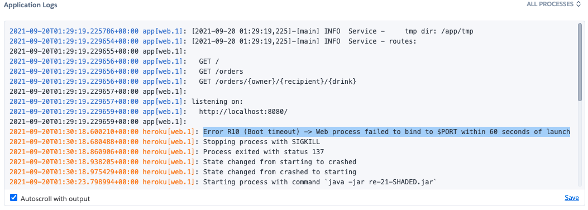

## Navigation

- [Go to summary](../README.md)
- [Go to previous act](./Act_4.md)

### Step IV.6: Witnessing our failure

We can now access to our application on Heroku. Go to the [heroku dashboard](https://dashboard.heroku.com/apps), click on your app and select `Open app`.

Nothing is happenning ...

Go back to the previous page, and select `More/View logs`

We are forcing to use port `8080`, where heroku actually expects to choose a port for us. the app cannot be deployed this way.

The pipeline cannot know this information, as, from its point of view, the deployment was OK, i.e., Heroku has accepted the image. Hopefully, we know have a CI/CD pipeline that will support us to fix this mistake.
